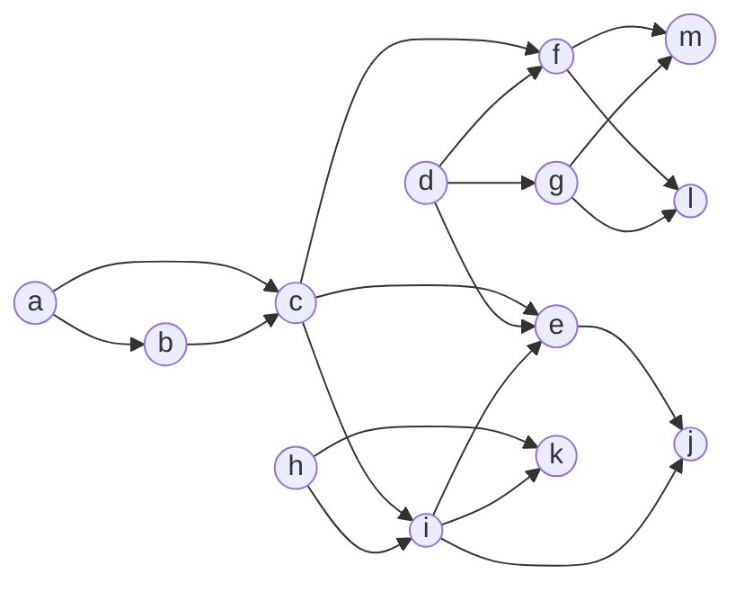

```toc
```

# SWISH
Nelle scorse lezioni abbiamo visto la sintassi e la semantica di un esecutore PROLOG. Questa volta vediamo l'esecutore nell'effettivo, navigando alla pagina WEB https://swish.swi-prolog.org.

SWI-PROLOG è la variante di PROLOG più utilizzata e conosciuta al giorno d'oggi: SWISH è open source, molto semplice da usare in quanto la linea di comando interattiva, ci permette di eseguire programmi senza bisogno d'installare un ambiente.

| ![[Pasted image 20230519103006.png\|450]] |
| ----------------------------------------- |
| L'esecutore online di SWI-PROLOG                                          |

Quello che c'interessa vedere sono dei programmi, quindi, una volta caricata la pagina, clicchiamo sul bottone blu "Program" per creare un programma PROLOG. 

| ![[Pasted image 20230519103245.png\|400]] |
| ----------------------------------------- |
| La pagina aggiornata dopo aver cliccato "Program"                                          |

Sulla sinistra avremo una finestra interattiva in qui potremo digitare e comporre il nostro programma; sulla destra in basso invece, si trova la linea di comando, in cui potremo digitare il goal da passare all'esecutore ed eseguire il programma a esso associato, premendo "Ctrl+ENTER" oppure premendo il bottone "Run!". 

> [!tip] Installare SWI-PROLOG localmente
> L'esecutore online ha una limitazione in particolare che potrebbe influire l'apprendimento, che è quella della cronologia d'esecuzione. Una volta avviata la ricerca del goal per un programma, l'esecutore ricorda il numero di esecuzioni prese per la sessione corrente: un certo numero limitato di goal può essere richiesto alla volta.
> 
> Installare l'ambiente localmente, elimina la limitazione e fornisce più controllo in generale. L'installazione da seguire per Windows e sistemi basati su Unix, si trova alla repository https://github.com/SWI-Prolog/swipl-devel.git.
> 
> Alternativamente, su sistemi Linux, controllare la disponibilità del pacchetto "swi-prolog" (e.g.: su arch, `sudo pacman -Syyu swi-prolog`).
> 
> Fatto ciò, il file PROLOG con estensione `.pl`, o `.prolog` per evitare conflitti con file Perl, può essere caricato da `swipl` usando il comando: `swipl nomedelfile.prolog`. I goal sono poi inseriti nella linea di comando dell'esecutore, evidenziata dai caratteri `?- `.
> 
> |![[Pasted image 20230519180017.png\|500]]|
> |:----:|
> |`swipl` su Arch Linux|

---
Partendo dalle cose semplici, vediamo un programma PROLOG e la sua esecuzione.
L'esempio che stiamo per vedere, può essere anche menzionato come esempio di DATABASE PROLOG: data la semplicità delle nostre query, quello che altro non stiamo facendo è l'interrogazione di un ipotetico database, dove per righe abbiamo le variabili e per colonne gli stati di queste.

```prolog
p(a).
p(c).

p(a, b).
```
- `p(a).` e `p(c).` sono dei fatti che dicono "`p(a)` è vero" e "`p(c)` è vero" rispettivamente. `p()` è una clausola, `a` e `c` sono i fatti contenuti nella clausola: l'arità è $1$.
- `p(a, b)` è una clausola che contiene 2 fatti, arità $2$. La clausola dice "se `b`, allora `a`", dove `b` è `false`, mentre `a` è `true`.

Il goal
```prolog
p(X).
```
chiede all'esecutore "per quale valore di `X`, il predicato `p()` viene soddisfatto?".
Di possibilità possiamo vedere che ce ne sono 2: quella in cui `X=a` e quella in cui `X=c`, perché appunto sono gli unici fatti, da noi scritti, che rendono vera la clausola.

Premendo "Ctrl+ENTER" oppure "Run!", una finestra compare sopra il logo di SWISH, comunicandoci una delle soluzioni trovate. Se esistono altre soluzioni, l'esecutore rimane in attesa di eventuale risposta dall'utente, che dovrà premere "Next" per vederle una ad una oppure, se molte sono presenti, cliccare uno degli altri bottoni per mostrarne 10, 100 o 1000. Il bottone "Stop" abortisce l'esecuzione.

| ![[Pasted image 20230519181526.png\|350]] |
| :------------------------------------: |
| Le 2 soluzioni al programma visto sopra                                     |

L'esecutore, oltre che alle soluzioni, può ritornare lo stato di una o più variabili, sempre parlandogli in termini di goal. Se chiedessimo per esempio, per lo stesso programma, il goal
```prolog
p(a).
```
questo ritornerà `true`, mentre per 
```prolog
p(a, X).
```
ritornerà `X=b`, siccome l'unica variabile che rende vera `a`.

| ![[Pasted image 20230519182350.png\|350]] |
| :-----------------------------------------: |
|Risposta alle due interrogazioni appena menzionate                                           |

# `dag.pl`
> [!abstract] Vedere il programma `dag.pl` (eliminate le ultime 5 linee di codice)

Nel nostro mondo ci sono una serie di nodi, indicati con la dicitura `node().`.
I nodi prendono nome dalle lettere `a` alla `m`, scelte perché sono costanti senza parentesi tonda (atomi).

Gli archi sono invece delle coppie di nodi, indicati con `arc().`.
Per mettere nodi insieme, l'atomo $\mathtt{arc}()$ ha 2 argomenti che sono il nodo di partenza e il nodo di arrivo, separati da una virgola "$,$". 



In questa versione, supponiamo che quello che abbiamo costruito sia un <u>Grafo Diretto Aciclico</u> (DAG). Quello che c'interessa fare è un predicato che ci dica se esiste un percorso tra il nodo `X` e un nodo `Y`, indicanti il nodo di partenza e il nodo di arrivo rispettivamente. Se il percorso esiste, il goal verrà soddisfatto e l'esecutore PROLOG ci dirà `true`; se il percorso non esiste, l'esecutore PROLOG non avrà modo di soddisfare il goal e restituirà `false`.

## Verificare il collegamento
Il seguente predicato ci dice "se esiste un arco che collega `Y` con `X`, allora esiste un percorso che collega `Y` con `X`", dove `X` e `Y` sono 2 variabili diverse tra di loro.
```prolog
% ...
path(X, Y) :-
	arc(X, Y).
```
Il goal proposto
```prolog
path(a, b).
```
verifica appunto che esiste un percorso che porta da `a` verso `b`, restituendo `true`.

---
Questo però lo fa soltanto per i nodi che sono in prossimità minima rispetto alla prima componente. Un esempio che più rispecchierebbe una rappresentazione del grafo, sarebbe quello che aggiunge il seguente codice
```prolog
% ...
path(X, Y) :-
	arc(X, Z),
	path(Z, Y).
```
- "se esiste un percorso che porta `Y` a `Z`, allora c'è un arco che porta `Z` a `X` e quindi un percorso che porta `Y` a `X`", oppure letto in modo più naturale
- "esiste un percorso che va da `X` a `Y`, per cui esiste un arco che porta `X` a un nuovo nodo `Z`, che a sua volta porta al nodo `Y`".

Quindi ora, non solo riusciamo a legare i nodi prossimi, ma anche i nodi che vengono dopo e che raggiungono una destinazione ulteriore. Il seguente goal
```prolog
path(a, c).
```
attesta che per raggiungere il nodo `c`, esistono 2 percorsi, quindi 2 volte `true` viene stampato. Se invece che specificare il nodo di partenza `a`, dessimo una variabile libera `x`, all'ora l'esecutore ci dirà quali variabili portano alla destinazione `c`. Il seguente goal
```prolog
path(X, c).
```
restituisce `X=a`, `X=b` e `X=a`. La prima soluzione viene stampata due volte, perché per arrivare a `c` si può intraprendere il percorso diretto (`a -> c`) oppure quello indiretto (`a -> b -> c`).

## Calcolo del percorso
Oltre che avere la verifica, vorremmo anche calcolare il percorso per raggiungere un nodo: vorremmo un 3<sup>o</sup> argomento per tenere traccia di tutti i punti in cui passiamo e quindi avere come risultato, l'elenco dei nodi che abbiamo toccato.

Per farlo, ci serve un modo per raccogliere questi nodi: siccome elaboriamo termini, un modo per mettere le cose insieme è fare diventare il nuovo argomento, un <u>simbolo di funzione</u> qualsiasi. 

- L'atomo simbolo di funzione `w`, stamperà un percorso `P`; lo scopo è quello di rispondere alla domanda "quale è il percorso `P` che da `X` va in `Y`?". Per farlo, diciamo che "esiste un percorso che va da `X` a `Y`" se "esiste un arco che va da `X` a `Y`" con `w(X,Y)`.

- Il percorso che risponde alla domanda "quale è il percorso che da `X` va a `Y` passando per `Z`?", è quello che parte da `X` (1<sup>o</sup> argomento di `w`) e prosegue da `Z` per arrivare a `Y`: lo chiamiamo `P` (2<sup>o</sup> argomento di `w`).

```prolog
%...
% il percorso che va da X -> Y è l'arco X -> Y
path(X, Y, w(X, Y)) :-
	arc(X, Y).

% il percorso P che collega X -> Z e Z -> Y
path(X, Y, w(X, P)) :-
	arc(X, Z),
	path(Z, Y, P).
```

Il goal "come faccio ad andare da `a` a `f`?"
```prolog
path(a, f, P).
```
riceve risposta `P = w(a,w(b,w(c,f)))` che interpretata in linguaggio naturale: costruisco percorso con primo nodo `a` e secondo percorso con primo nodo `b` e terzo percorso con primo nodo `c` e secondo nodo `f`, oppure scritto conciso, `a -> b -> c -> f`.
Cliccando "Next" vediamo l'altro percorso possibile, `a -> c -> f`.

Possiamo anche permetterci di scrivere il goal
```prolog
path(X, f, P).
```
per chiedere "quali sono tutti i percorsi `P` che posso costruire partendo da `f` e arrivando in un qualche `X`?" La risposta di tutti questi percorsi ci viene stampata, insieme al nodo da cui siamo partiti.

| ![[Pasted image 20230519225118.png\|350]] |
| :-----------------------------------------: |
|Risposta al goal `path(X, f, P).`                                           |
## Denominazione dell'operatore
Esteticamente, una variabile più gradevole può essere composta.
`w` può essere scritta in modo infisso, leggendo soltanto le lettere separate magari da una virgola, oppure legate da una freccia.

Fortunatamente, PROLOG consente la definizione di operatori nuovi.
Creiamo un operatore "freccia" che permetta di avere a sinistra una costante e a destra un percorso (xfy); l'indice di precedenza, per come lo stiamo usando, può essere una costante qualsiasi che non interferisca con gli operatori di SWI-PROLOG, definiti nella tabella alla pagina Web https://www.swi-prolog.org/pldoc/man?section=operators.

Per dichiarare il nuovo operatore, convenzionalmente lo si fa in cima al programma
```prolog
:- op(450, xfy, ~>).
```
- `:-` indica una regola che deve essere soddisfatta, quindi PROLOG per prima cosa verificherà questa, prima di passare al resto del codice;
- `op()` è la funzione che crea/ridefinisce un operatore e ha 3 argomenti
	- `450` l'indice di priorità, inferiore agli indici aritmetici di base per evitare di stampare l'ordine dei nodi al contrario;
	- `xfy` il punto in cui si trova l'operatore tra i due argomenti;
	- `~>` il simbolo, che può essere uno qualsiasi.

Anziché scrivere il simbolo di funzione, usiamo l'operatore appena creato
```prolog
% ...
path(X, Y, X~>Y) :-
    arc(X, Y).
path(X, Y, X~>P) :-
    arc(X, Z),
    path(Z, Y, P).
```

Usando il goal
```prolog
path(a, f, P).
```
questo restituirà il risultato.

| ![[Pasted image 20230519232755.png\|350]] |
| :-----------------------------------------: |
| Risposta al goal `path(a, f, P).`                                          |
## Uso delle liste
Un modo più semplice e ovvio per mostrare una sequenza di nodi è metterli in una <u>lista</u>. Siccome abbiamo una sintassi speciale per le liste che non richiede operatore siccome già definito, possiamo usare queste.

Per usarle, dobbiamo ricordarci cosa vuole dire usare le parentesi "$[\ ]$": quando lo facciamo e il numero di elementi è 2, stiamo costruendo la coppia formata dal 1<sup>o</sup> argomento e il 2<sup>o</sup> argomento.

```prolog
% ...
path(X, Y, [X, Y]) :-
    arc(X, Y).
path(X, Y, [X | P]) :-
    arc(X, Z),
    path(Z, Y, P).
```
- `[X, Y]` indica una lista di 2 elementi, la lunghezza è $2$;
- `[X | P]` indica una lista che inizia con `X` e prosegue con `Y`, $1+\mathtt{lenght}(Y)$.

| ![[Pasted image 20230519234122.png\|350]] |
| :-----------------------------------------: |
| Risposta al goal `path(a, f, P).`                                          |
### Predicati
Alcuni dei predicati su liste di SWI-PROLOG, modificati per renderli più semplici da seguire, rimanendo praticamente identici alle versioni originali.
#### `member()`
```prolog
% member(?Term, ?List)
% Succeeds if Term unifies with a member of the list List.
member(X, [X | _]).
member(X, [_ | T]) :-
    member(X, T).
```
`member()` è il predicato più semplice con 1<sup>o</sup> argomento è l'elemento in ricerca e 2<sup>o</sup> argomento la lista in cui è cercato l'elemento.

Il goal viene soddisfatto per ogni occorrenza di `X` all'interno della lista `Y`.
Se stiamo per esempio cercando il valore `X` e questo di presenta 3 volte, `member()` verrà soddisfatto 3 volte.

```prolog
member(X, [1, 2, 3]).
```

#### `append()`
```prolog
% append(?List1, ?List2, ?List3)
% Succeeds if List3 is the result of appending List2 to List1.
append([], X, X).
append([X | L1], L2, [X | L3]):-
    append(L1, L2, L3).
```
`append()` prende la lista #1 e la lista #2; il goal è soddisfatto se la lista #3 è formata dalla concatenazione delle altre due liste.

Per esempio, la lista `[1, 2]` concatenata alla lista `[3, 4]`, restituirà `[1, 2, 3, 4]`.

```prolog
append([1, 2], [3, 4], R).
```
#### `prefix()`
```prolog
% prefix(?List1, ?List2)
% Succeeds if List1 is a prefix of List2.
prefix(X, Y) :-
    append(X, _, Y).
```
`X` è un prefisso di `Y` se esiste una terza lista che concatenata a `X`, restituisce `Y`.
Questa definizione di prefisso si trova anche nei linguaggi formali.
#### `select()`
```prolog
% select(?Element, ?List1, ?List2)
% Succeeds if List2 is List1 less an occurence of Element in List1.
select(A, [A | B], B).
select(A, [B, C | D], [B | E]) :-
    select(A, [C | D], E).
```
`select()` è vera se la lista #2 la si può ottenere dalla lista #1 sottraendo una delle occorrenze di un elemento nella lista #1. Viene selezionato un elemento da una lista, eliminato questo e prodotta la nuova lista senza l'elemento.
#### `reverse()`
```prolog
% reverse(+List, ?Reversed)
% Succeeds if Reversed is the reversed list List.
reverse(List, Rev) :-
    reverse(List, Rev, []).

reverse([], L, L).
reverse([H | T], L, SoFar) :-
    reverse(T, L, [H | SoFar]).
```
`reverse()` è più complicato dagli altri perché non è formato da un unico predicato, ma ha 2 arità diverse. Quello che a noi interessa è quello con 2 argomenti: prende una lista esistente e costruisce la stessa lista ma al contrario. Per fare ciò usa lo stesso predicato ma con 3 argomenti: nel 3<sup></sup> argomento viene accumulata la lista fino a quel momento; quando arriva alla fine dove nulla più può essere invertito, allora l'argomento stesso è la lista di nostro interesse.

---
11/05/2023