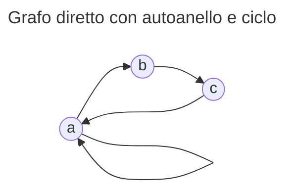

```toc
```

# Il Linguaggio PROLOG<sub>!</sub>
Come abbiamo visto, il linguaggio PROLOG è decisamente diverso dai linguaggi a cui siamo abituati, è dichiarativo e quindi prevede di descrivere il problema in modo che l'esecutore cerchi una soluzione. Per come è fatto, PROLOG<sub>0</sub><sup>+</sup> può essere sufficiente per i nostri scopi, non ci servirebbe altro. 

Il problema tuttavia è che se affrontiamo <u>ciclicità</u>, a differenza del grafo aciclico visto la scorsa lezione, la ricerca delle soluzioni avviene ugualmente, portando a cicli infiniti. PROLOG<sub>0</sub><sup>+</sup> non è ancora sufficiente perché <u>non ha modo di bloccare le scelte non deterministiche</u>.

```prolog
arc(a, a).
arc(a, b).
arc(b, c).
arc(c, a).

path(X, X, [X]).
path(X, Y, [X | R]) :-
	arc(X, Z),
	path(Z, Y, R).
```
La regola $\mathtt{path()}$, il cui scopo è quello di calcolare il percorso tra 2 nodi, nel goal 
```prolog
path(a, c, P).
```
1. porta alla ricerca di una soluzione che non arriverà mai, siccome su `a` è presente un auto anello; e
2. se anche lo eliminassimo, commentando la linea di codice che lo descrive, avremmo infinite volte la realizzazione del percorso, nonostante questo sia sempre lo stesso `[a, b, c]`.
   
   | ![[Pasted image 20230520180718.png\|320]] |  ![[Pasted image 20230520180857.png\|300]]   | 
   | ----------------------------------------- | --- |
   | Auto anello: eccesso di memoria                        |   Goal soddisfatto infinite volte  |

Possiamo permettere al programmatore di dialogare con l'esecutore con affermazioni del tipo "da qui in avanti non proseguire" oppure "da qui in avanti, soluzioni utili non ce ne sono", per cercare di risolvere questo grosso problema. Facendo ciò devieremo dalla semantica logica del linguaggio, perché non sarà più vero che le deduzioni saranno sempre razionali.

Uno dei diversi modi per implementare questa soluzione, è usando il "cut", simbolo "$!$": l'albero di ricerca viene "tagliato" in modo d'arginare il problema. Potremmo altrimenti usare la negazione, che però è complessa da implementare perché <u>variabili libere</u> che non sono ancora state assegnate, è difficile negarle.

## Cut (!)
> [!warning] La negazione può essere solamente approssimata in PROLOG
> In altri linguaggi di programmazione dichiarativi logici, come Datalog, questo può essere più viabile, considerando comunque la grande complicanza della semantica.


$$Conjunct\to Atom\ |\ Atom(Arguments)\ |\ !$$
Supponiamo di avere $!$ nel corpo di una regola del tipo $h\textrm{ :- }b.$ ("vale $h$ se vale $b$").
1. Tutte le scelte non deterministiche che sono state create da quando l'esecutore ha cercato di soddisfare $h$, vengono scartate; $!$ funziona come una <u>barriera</u>.
2. Se $h$ può essere soddisfatto con altre possibilità, perché magari sotto ci sono altre cose che unificano il goal, allora anche quello che viene dopo, sarà <u>scartato</u>.

Non solo viene scartato quello che sta sopra al cut, ma anche quello che è sotto. Questo operatore serve per dire all'esecutore che se siamo arrivati a un certo punto del programma, tutte le scelte aperte non interessano più. 

Nel momento in cui il cut non taglia fuori dall'insieme di soluzioni possibili, alcuna soluzione, allora questo prenderà il nome di *green cut*: tutte le soluzioni che non vado a produrre a causa del cut sono l'insieme vuoto $\emptyset$, oppure sono soluzioni che ho già, guadagnandoci in termini di tempo. 

Se l'answer set del programma viene modificato, eliminando delle possibili soluzioni, allora l'operazione prenderà il nome di *red cut*. Se esiste un percorso e non c'interessa quale, allora quest'ultimo operatore non ha importanza, nel senso che non ci è dannoso per la ricerca di una soluzione. Tuttavia, se il red cut elimina una soluzione che possibilmente sarebbe più veloce della prima disponibile, allora stiamo perdendo in termini di tempo computazionale.

---
```prolog
p(a).
p(X) :- q(X), !, r(X).
p(b).
p(c).

q(y).
q(z).

r(y).
r(z).
```
Nel programma sopra, è presente un cut nel corpo della regola che definisce `p`. Supponendo che il nostro goal sia `:- p(W).`, per soddisfarlo PROLOG parte dall'alto e procede verso il basso:
- `p(a).` non ha corpo perché fatto, quindi già soddisfatto; viene subito stampato `W=a`;
- premendo "Next" scendiamo con l'esecuzione, arrivando alla regola "se vogliamo che `p(X)` sia vera, allora `q(X)` deve essere vera" e l'unica affermazione che conferma ciò è quella per cui `X` è uguale a `y`, stampando la soluzione `W=y`;
- `!` è sempre vero, tentativi non deterministici vengono scartati
	- siccome `p(X)` è ancora in attesa di eventuali risposte dall'esecutore, perché la regola non è finita, viene cercata una soluzione che in questo caso sarebbe `q(z)` che però non può essere presa siccome il cut è presente;
	- `p(b)` e `p(c)` anche loro vengono scartati siccome il cut è stato incontrato.

In questo caso, il nostro è un red cut.

## true, fail, \\= 
```prolog
true.
```
Indica che esiste un atomo che si chiama `true` che viene soddisfatto dal fatto `true.`.
Se all'interno dei nostri goal vogliamo scrivere `true.`, possiamo farlo e verrà soddisfatto dal fatto. `true.` viene introdotto insieme al cut, nel linguaggio PROLOG<sub>!</sub><sup>+</sup>, perché ha un comportamento simile a quello del cut: viene sempre soddisfatto, come se fosse "trasparente"; serve a esprimere dei goal che non falliscono mai.

---
```prolog
fail :-
	a = b.
```
`fail.` viene soddisfatto quando l'atomo `a` è uguale all'atomo `b`, quindi mai.
Questo congiunto è uno che non viene mai soddisfatto, l'esatto opposto di `true.` ma che anche lui necessità dell'esistenza del cut: serve a rappresentare goal che fallisce sempre.

---
```prolog
X \= X :-
	!, fail.
X \= Y.
```
La presenza di `!` e `fail.` ci permette d'introdurre una prima approssimazione della negazione. L'operatore `\=`, letto come "negazione per fallimento" o "negazione causata da fallimento", dice che se abbiamo a sinistra e a destra 2 cose che possono essere tra loro unificate, allora `!, fail.`:
- `!` impedisce di tornare indietro in orizzontale e in verticale nel programma;
- `fail.` non permette di andare avanti.

## Soluzione al problema ciclico
L'introduzione di questi nuovi operatori, permette di risolvere il problema visto sopra, aggiungendo e appoggiandoci a 2 nuovi predicati.

```prolog
node(a).
node(b).
node(c).

arc(a, a).
arc(a, b).
arc(b, c).
arc(c, a).

path(X, Y, P) :-
	path1(X, Y, [], P).

path1(_, X, V, _) :-
	member(X, V),
	!,
	fail.
path1(X, X, V, [X | V]).
path1(Y, X, V, R) :-
	arc(Z, X),
	path1(Y, Z, [X | V], R).
```

Il predicato $\mathtt{path1()}$ ha lo scopo di capire se un ciclo sta per essere innescato, su un grafo che non necessariamente è aciclico. Se l'esecutore PROLOG comincia a prendere strade che già sono state intraprese, allora semplicemente non ci tornerà. Per farlo, le strade viste vanno memorizzate, usando un terzo argomento aggiuntivo.

---
```prolog
% ...
path(X, Y, P) :-
	path1(X, Y, [], P).
% ...
```
Per soddisfare il percorso `(X, Y, P)`, cerchiamo di soddisfare il `path1(X, Y, [], P)`. La lista è vuota perché inizialmente non è visitato alcun percorso.

---
```prolog
% ...
path1(_, X, V, _) :-
	member(X, V),
	!,
	fail.
% ...
```
Se per qualche ragione, dobbiamo raggiungere un nodo `X` indipendentemente da dove partiamo `_`, avendo visitato un insieme di nodi `V`, se `X` è già stata visitata (`member(X, V`) allora `!` e `fail.`: se siamo nelle condizioni di volere andare in `X` ma in questa già siamo stati, in `X` non andiamo. Se invece vogliamo andare in `X` partendo da `X` avendo visitato `V`, allora ci basta un percorso che inizi con `X` e vada avanti con `V`.

---
```prolog
% ...
path1(Y, X, V, R) :-
	arc(Z, X),
	path1(Y, Z, [X | V], R).
```
Un'altra possibilità non necessariamente esclusiva, è quella in cui se vogliamo andare in `X` partendo da `Y` avendo visitato `V`, allora ci deve essere un arco che finisce in `X` partendo da un nodo precedente prossimo `Z`, e ci deve essere un percorso che da `Y` va in `Z`, tenendo conto però che `X` già è stato visitato, quindi aggiungendolo all'elenco dei nodi già visitati. Se il percorso viene trovato, allora abbiamo una soluzione. 

## Perché la negazione è problematica
```prolog
nonmember(_, []).
nonmember(X, [X | _]) :-
	!,
	fail.
nonmember(X, [_ | R]) :-
	nonmember(X, R).
```
$\mathtt{nonmember()}$ serve a confermare se un elemento non è membro di una lista, usando una variante di $\mathtt{member()}$ che abbiamo visto in precedenza, aggiungendo `!` e `fail.` L'esempio sopra, che si trova in numerosi esempi di come mai la negazione non funzioni bene, non si comporta bene per un goal dove variabili libere sono presenti; i seguenti goal
```prolog
:- nonmember(R, [a, b, c]).
```
```prolog
:- nonmember(z, [a, b, R]).
```
restituiscono `false`; siccome `R` può essere contenuta in `[a, b, c]`; siccome `z` può essere contenuta in `[a, b, R]`, andando a sostituire `R`.

Questa negazione offerta da PROLOG viene riferita come *negazione per fallimento*, proprio perché il goal non soddisfacibile affermato, viene negato ai fini di ovviare al problema visto sopra. L'utilizzo del cut consente di evitare queste situazioni anomale, perché possono essere evidenziate più facilmente e risolte in accordo. 

Dal punto di vista semantico, dobbiamo fare in modo di ricordare se incontriamo cut perché poi non dobbiamo più andare avanti nelle altre alternative sottostanti. Dato un programma $\pi$, un goal $G$, calcoliamo con $\sigma^\pi_G$ una sostituzione $\theta$ che renda soddisfatto il goal tramite l'operazione
$$\gamma_1\otimes\gamma_2\begin{cases}
!&\textrm{se}\quad \gamma_1=\ !\lor\gamma_2=\ !\\
\bot& \textrm{altrimenti}
\end{cases}$$
attestante lo stato del cut, con il simbolo $\gamma$.
Se il simbolo vale $!$, significa che la computazione è stata alterata appunto dal cut; se il simbolo vale $\bot$, la computazione non è stata alterata. 

> [!abstract] Del materiale didattico visto a lezione non è quì commentato siccome richiesto di essere ignorarato dal professore.

---
16/05/2023